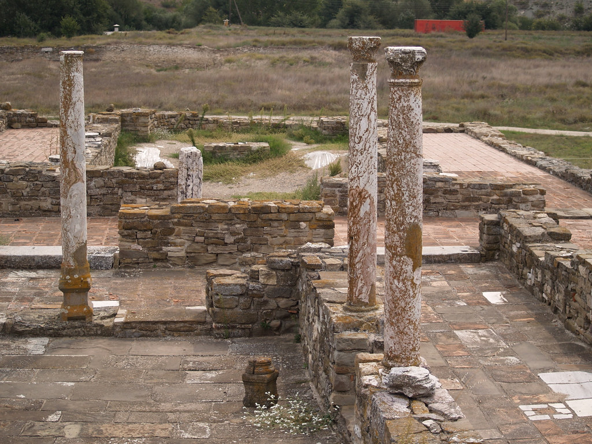
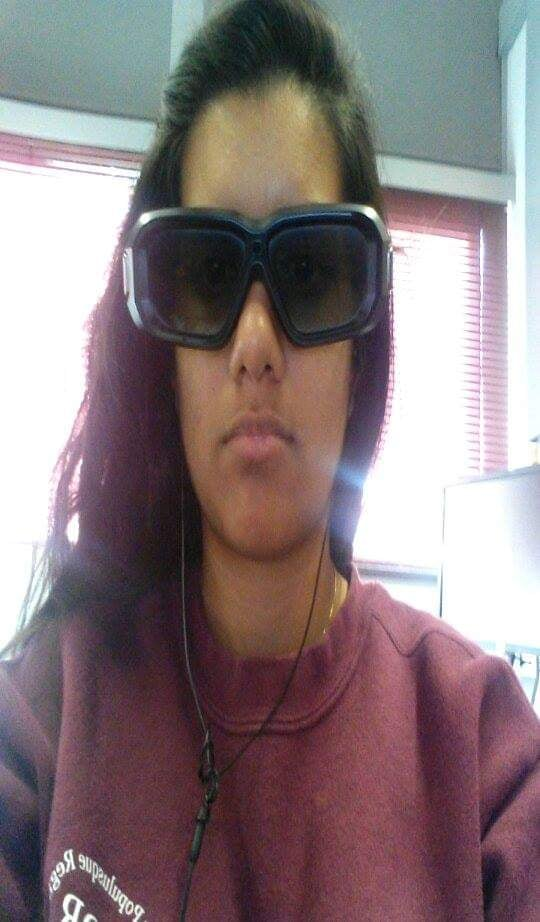
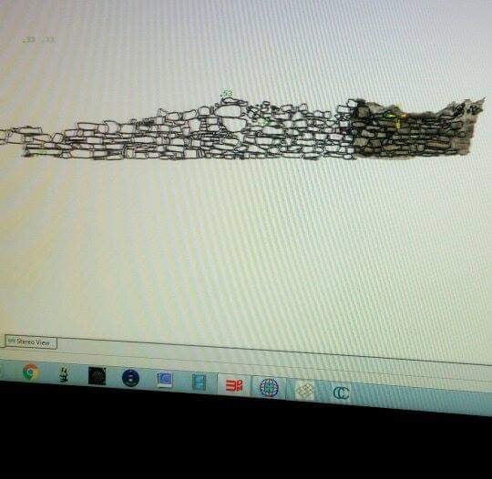
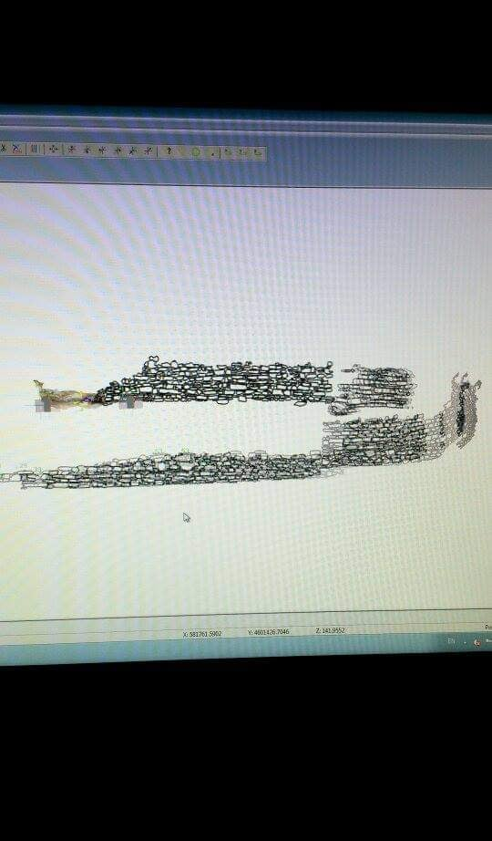
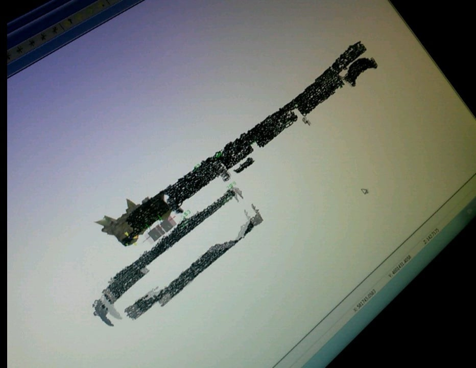

# Photogrammetric Stereoplotting of the Theodosian Palace at the Ancient Site of Stobi, Republic of Macedonia: Reviving a 20th Century Technique for the 21st Century

Throughout my academic career, other than my MA paper, my *absolute* favourite piece of work was my paper **Photogrammetric Stereoplotting of the Theodosian Palace at the Ancient Site of Stobi, Republic of Macedonia: Reviving aa 20th Century Techniques for the 21st Century**. In order to write this paper, I had to first conduct research at the ancient site of Stobi, in the Republic of North Macedonia.  Here is a link that includes the history of the site, and information about each building. [National Institution Stobi](http://www.stobi.mk/Default.aspx?page=155) .
Here I was able to participate in archaeological excavation, as well learn mapping. For my undergraduate independent research, I used several images taken of the so-called Theodosian Palace and stitched them together using the programs AgiSoft Photoscan, 3DM CalibCam and 3DM Analyst. Once I had built the orthophotos, I was able to draw each stone in 3D.  
I got to wear these really neat glasses so that I could see the images in 3D.  I had to draw each stone that I saw using 3DM Analyst software.    [TheodosianPalaceVideo](TheodosianPalaceVideo.mp4)
After drawing all of the stones in the orthophotos, the drawings were matched with the physical stones to ensure there were no added or missing materials, and then the drawings were uploaded to AutoCAD. My drawings were used in further projects for the site, and remain as official documentation for the site of Stobi. The point of this research was to compare the process to earlier forms of mapping, and prove how technology can aid in the process of archaeological recording.

## The Workflow

To put it simply, the work flow was as follows:

1. Travel to Stobi.
2. Set up ground control points.
* Survey GCP with a total station within 1cm accuracy.
3. Take pictures of the Theodosian Palace at the site of Stobi.
 * ensuring that each photo taken had a 70% overlap.
 4. Upload images to 3DM CalibCam to generate points, and create orthophotos using stereopairs.
 * This programs generates points based on a matching system. 
5. Open orthophotos in 3DM Analyst and start mapping stone features.
6. Continue this process with all stereopairs until finished.
7. Match the mapped stones to the real walls.
* Add any stones missing or remove stones that are not there.
8. Upload map to AutoCAD with real world coordinates.

### Statistics 

The table is organized by the task that was completed, the number of items for each task, and the amount of time it took to complete.

| Task                 | Amount             | Hours/Days       |
| --------------- | :--------------: | ---------------: |
| Ground Control Points| 30 | 10 hours |
| Images | 400+ | 30 hours |
| Mapped Stones | 15,000+ | 150 Days |